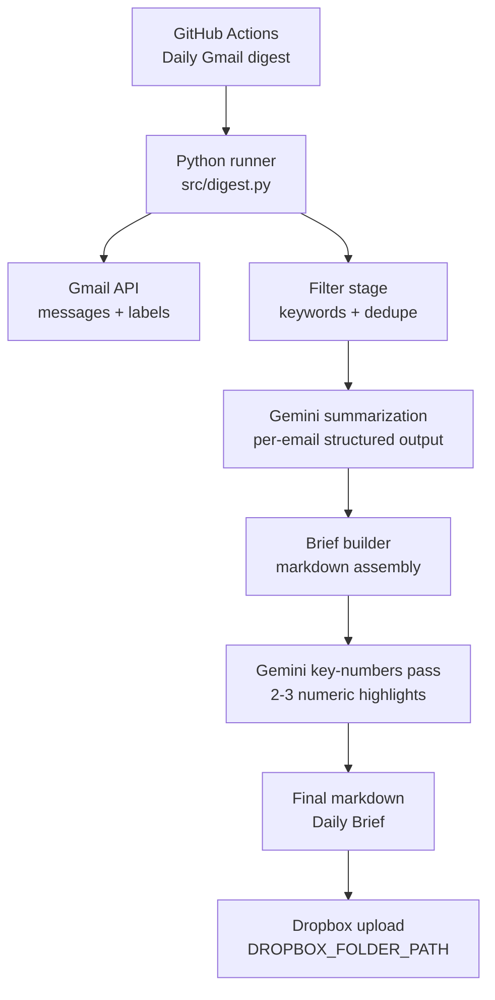

# Daily Gmail Brief to Dropbox

Automated daily workflow that reads Gmail newsletters, filters noise, summarizes with Gemini, and writes an Obsidian-friendly Markdown brief to Dropbox.

## What This Workflow Does

1. Triggers on schedule (daily) or manual run.
2. Authenticates to Gmail with OAuth refresh token.
3. Pulls messages for each configured parent label (including sublabels).
4. Applies keyword filtering to remove obvious low-signal messages.
5. Summarizes each retained message using Gemini into structured fields.
6. Builds a daily brief with:
   - title
   - key numbers
   - theme index table
   - per-article sections grouped by theme
7. Uploads `YYYY-MM-DD-daily-brief.md` to Dropbox.

## Architecture Diagram



## Repository Layout

```text
.github/workflows/daily-digest.yml   # schedule + manual workflow
src/digest.py                        # fetch -> filter -> summarize -> build -> upload
.env.example                         # local template (no real secrets)
requirements.txt
tests/test_digest.py
```

## Secure Setup (Step by Step)

### 1) Fork or clone the repository

Use your own GitHub repository so Actions and secrets are under your control.

### 2) Configure Gmail OAuth (Google Cloud)

1. Create/select a Google Cloud project.
2. Enable Gmail API.
3. Create one OAuth client (Web or Desktop).
4. Generate a refresh token for `https://www.googleapis.com/auth/gmail.readonly`.
5. Keep client ID, client secret, and refresh token from the same OAuth client.

### 3) Configure Gemini API

Create an API key for Gemini and choose a model (for example `gemini-flash-latest`).

### 4) Configure Dropbox OAuth (recommended: refresh-token auth)

Use refresh-token credentials for long-term stability (no daily token breakage):

- `DROPBOX_REFRESH_TOKEN`
- `DROPBOX_APP_KEY`
- `DROPBOX_APP_SECRET`

Optional fallback:

- `DROPBOX_ACCESS_TOKEN` (short-lived in many setups)

### 5) Add GitHub Actions secrets

In GitHub: `Settings -> Secrets and variables -> Actions -> New repository secret`

Required core:

- `GMAIL_CLIENT_ID`
- `GMAIL_CLIENT_SECRET`
- `GMAIL_REFRESH_TOKEN`
- `GEMINI_API_KEY`
- `GEMINI_MODEL`
- `SUMMARISATION_PERSONA`
- `GMAIL_LABELS`
- `DROPBOX_FOLDER_PATH`

Required Dropbox auth (recommended path):

- `DROPBOX_REFRESH_TOKEN`
- `DROPBOX_APP_KEY`
- `DROPBOX_APP_SECRET`

Optional:

- `DROPBOX_ACCESS_TOKEN` (fallback only)
- `DATE_WINDOW_DAYS`
- `FILTER_KEYWORDS`
- `MAX_EMAILS_PER_LABEL`
- `DEBUG`

### 6) Validate with a manual workflow run

1. Go to `Actions -> Daily Gmail digest -> Run workflow`.
2. Verify logs show:
   - labels resolved
   - emails fetched and summarized
   - final Dropbox upload success

### 7) Let schedule run daily

The workflow cron is in `.github/workflows/daily-digest.yml` and runs automatically once configured.

## Local Run (Optional)

```bash
python -m venv .venv
. .venv/bin/activate
pip install -r requirements.txt
cp .env.example .env
python src/digest.py
```

Unit tests:

```bash
pip install -r requirements-dev.txt
pytest
```

## Configuration Reference

- `GMAIL_LABELS`: comma-separated parent labels; sublabels are included.
- `DATE_WINDOW_DAYS`: Gmail lookback query window.
- `FILTER_KEYWORDS`: keyword drop list for subject/snippet.
- `MAX_EMAILS_PER_LABEL`: cap per parent label for each run.
- `SUMMARISATION_PERSONA`: tone and prioritization input to the model.
- `GEMINI_MODEL`: model name used for summarization and key numbers pass.
- `DROPBOX_FOLDER_PATH`: destination folder for daily brief markdown.

## Security and Privacy Rules

- Never commit secrets to the repo (including `.env`, docs, screenshots, issues, PR text).
- Keep `.env.example` as placeholders only.
- Use GitHub encrypted secrets for CI.
- Rotate credentials immediately if exposed.
- Prefer Dropbox refresh-token auth for reliable scheduled runs.
- This repo includes secret scanning guardrails (`.github/workflows/gitleaks.yml`).

## Troubleshooting

- `Gmail label not found`: confirm exact label names in `GMAIL_LABELS`.
- `unauthorized_client`: Gmail refresh token and client credentials do not match.
- `invalid_grant`: Gmail refresh token is expired/revoked; re-issue token.
- `expired_access_token` (Dropbox): move to refresh-token Dropbox auth secrets.
- Key numbers odd output: sanitizer now enforces strict numeric blockquote format and falls back cleanly.